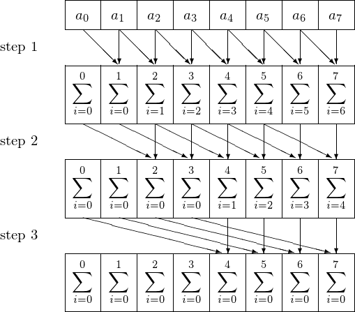
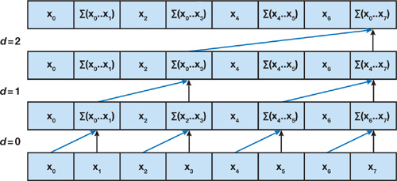
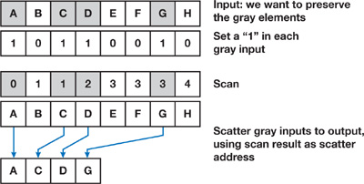
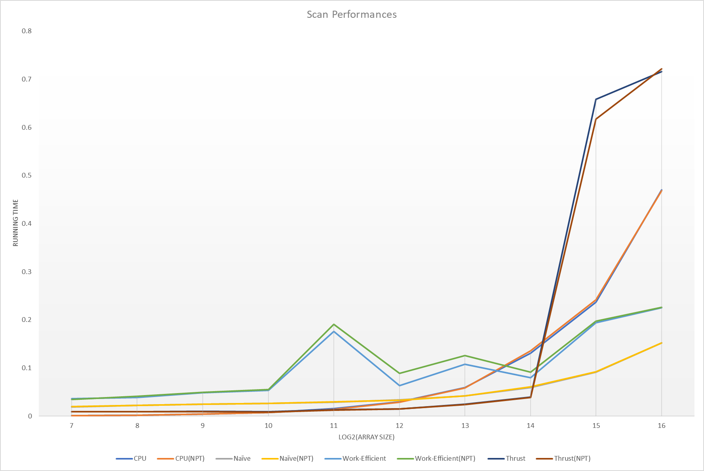
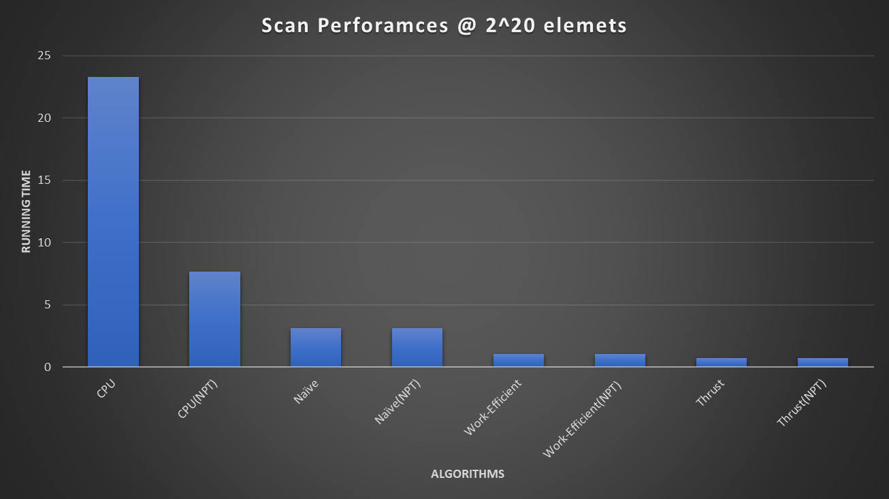
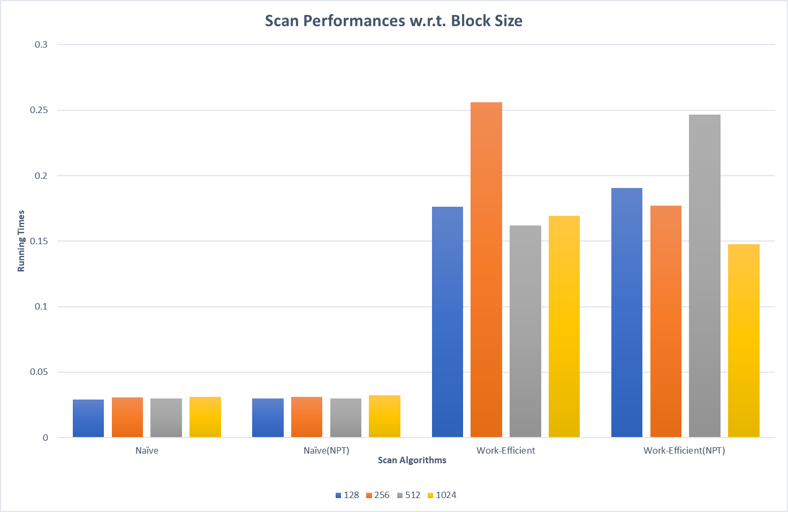
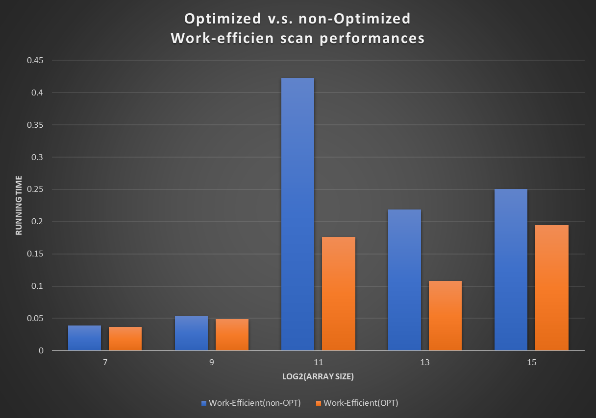
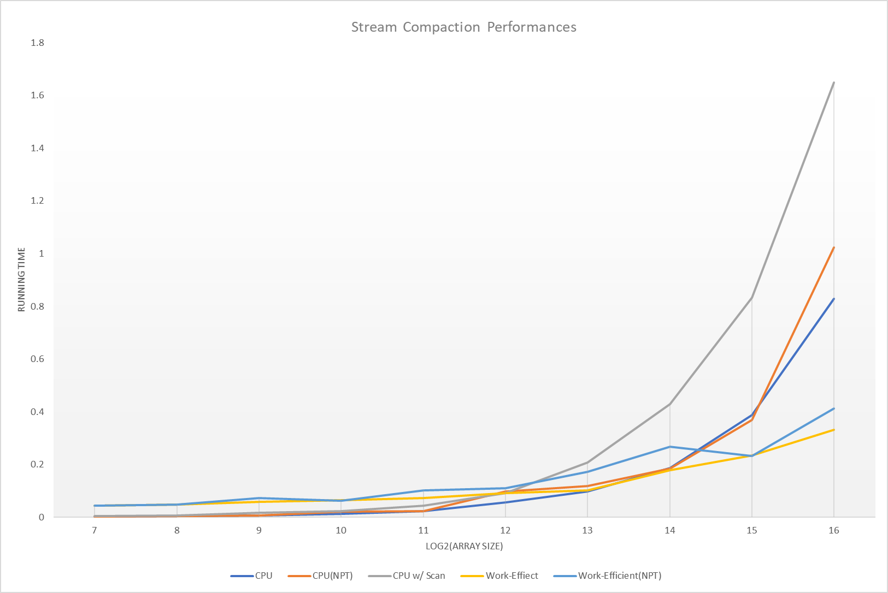

CUDA Stream Compaction
======================

**University of Pennsylvania, CIS 565: GPU Programming and Architecture, Project 2**

* Jie Meng
  * [LinkedIn](https://www.linkedin.com/in/jie-meng/), [twitter](https://twitter.com/JieMeng6).
* Tested on: Windows 10, i7-7700HQ @ 2.80GHz, 16GB, GTX 1050 4GB (My personal laptop)


## Background
### Scan 
*Prefix Sum*, A.K.A. *Scan*, is a widely used basic algorithm that:
given an array, for each index, compute the sum of array elements before it.
It is trivial to implement this on CPU, but we want to parallelize it to run on GPU.
On GPU, every thread will only access a small part of data. A naive parallel method is shown as the following image:



Given this naive algorithm, a more efficient algorithm that uses two sweeps is shown as:

Up-Sweep:



Down-Sweep:


This work-efficient algorithm reduced the complexity from *O(nlogn)* to *O(n)*


### Stream Compaction 
It is another widely used basic algorithm that:
given an array and a condition, wipe out all the elements that fails the condition. 
On CPU, it is also trivial to implement; on the GPU, we could also create a parallel version based on the previous scan algorithm:
* First map each element to a 1 or 0 based on whether it meets the condition;
* Then scan the mapped array using former parallel scan algoritm
* Finally scatter the original array




## Project Description
In this project, I implemented:
* CPU scan
* Naive GPU scan
* Work-Efficient scan
and
* CPU stream compaction
* CPU stream compaction with scan
* Work-Efficient GPU stream compaction
Performance analysis on these algoritms are conducted.

*Extra Credits*
* Optimization of Work-efficient GPU scan and stream compact, and performance comparison against non-optimized version.

### Performance Analysis 

- #### SCAN Algorithm Running Time w.r.t. Array Size 
  ##### Under Release x64, all @128 block size, work-efficient scan is *optimized*



  ##### Analysis
  1. As array size increases, all algorithms take more time to finish, where:
    * CPU Scanrunning time increases linearly
    * Naive methods perform good, running time increases slowly and substantially slower than CPU methods when array size goes up exponentially 
    * Work-efficient methods have fluctuating performances, which I'm not sure why. But it still out-performs CPU methods when array goes large.
  2. As for power-of-two against NPT performances:
    * In the work-efficient methods case, NPT usually takes longer to finish scan.
    * For other algorithms, NPT doesn't make noticable differences.
  3. Thrust performs weiredly:
    * Before 2^15 elements, thrust performs stably, and significantly faster than any other algoritms, but:
    * At 2^15 elements, thrust suddenly takes much longer time to finish than expected, and remains stable afterwards.
    * From NSight Performance Analysis, not much information could be gained pertaining mechanism behind thrust: you can only notice one memory allocation & free, one Device => Host and one Host => Device.
      But I guess thrust treat data at different stages, like before/after 2^15 elements. Performances within each stage is stable and optimized, but drop significantly across stages.
  
  4. When array size is at 2^20(not ploted on image), work-efficient methods are much better than naive methods:
  
      

- #### SCAN Algorithms Performances w.r.t. Block Size
  #### Under Release x64, all @2048 elements, work-efficient scan is *optimized*



   ##### Analysis
   1. For Naive method, block size doesn't make any noticable differences
   2. For Work-Efficient methods, they performs bad at specific block sizes. I'm not sure why, a reasonable guess is error.

- #### Work-Efficient Method: optimized v.s. non-optimized
  ##### Under Release x64, all @128 block size 

 

   ##### Analysis
   As we can see from the data chart, after removal of branch statement in kernel, and only launchs the threads that actually work, the performance
increases noticeably: I actually didn't expect this, since we are using just global memory here, and the constrain on performance should be memory access.

- #### STREAM COMPACTION performances are similar to Scans:
  #### @128 block size
 

- #### Console Output 
```
****************
** SCAN TESTS **
****************
    [   0   8  40  26  45  29  26  49   4  49  38   5  14 ...   9   0 ]
==== cpu scan, power-of-two ====
   elapsed time: 0.002188ms    (std::chrono Measured)
    [   0   0   8  48  74 119 148 174 223 227 276 314 319 ... 6397 6406 ]
==== cpu scan, non-power-of-two ====
   elapsed time: 0.002188ms    (std::chrono Measured)
    [   0   0   8  48  74 119 148 174 223 227 276 314 319 ... 6354 6355 ]
    passed
==== naive scan, power-of-two ====
   elapsed time: 0.022944ms    (CUDA Measured)
    passed
==== naive scan, non-power-of-two ====
   elapsed time: 0.021824ms    (CUDA Measured)
    passed
==== work-efficient scan, power-of-two ====
   elapsed time: 0.0392ms    (CUDA Measured)
    [   0   0   8  48  74 119 148 174 223 227 276 314 319 ... 6397 6406 ]
    passed
==== work-efficient scan, non-power-of-two ====
   elapsed time: 0.039936ms    (CUDA Measured)
    [   0   0   8  48  74 119 148 174 223 227 276 314 319 ... 6354 6355 ]
    passed
==== thrust scan, power-of-two ====
   elapsed time: 0.009088ms    (CUDA Measured)
    [   0   0   8  48  74 119 148 174 223 227 276 314 319 ... 6397 6406 ]
    passed
==== thrust scan, non-power-of-two ====
   elapsed time: 0.009152ms    (CUDA Measured)
    [   0   0   8  48  74 119 148 174 223 227 276 314 319 ... 6354 6355 ]
    passed

*****************************
** STREAM COMPACTION TESTS **
*****************************
    [   3   1   2   0   1   1   2   1   3   1   2   0   3 ...   0   0 ]
==== cpu compact without scan, power-of-two ====
   elapsed time: 0.004376ms    (std::chrono Measured)
    [   3   1   2   1   1   2   1   3   1   2   3   3   3 ...   1   1 ]
    passed
==== cpu compact without scan, non-power-of-two ====
   elapsed time: 0.004011ms    (std::chrono Measured)
    [   3   1   2   1   1   2   1   3   1   2   3   3   3 ...   3   1 ]
    passed
==== cpu compact with scan ====
   elapsed time: 0.006564ms    (std::chrono Measured)
    [   3   1   2   1   1   2   1   3   1   2   3   3   3 ...   1   1 ]
    passed
==== work-efficient compact, power-of-two ====
   elapsed time: 0.047104ms    (CUDA Measured)
    [   3   1   2   1   1   2   1   3   1   2   3   3   3 ...   1   1 ]
    passed
==== work-efficient compact, non-power-of-two ====
   elapsed time: 0.047104ms    (CUDA Measured)
    [   3   1   2   1   1   2   1   3   1   2   3   3   3 ...   3   1 ]
    passed
Press any key to continue . . .
```
